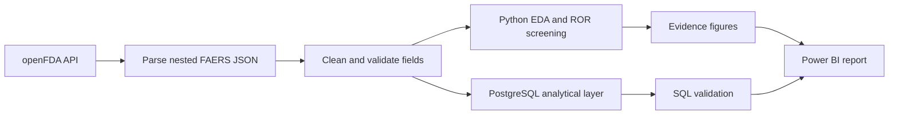
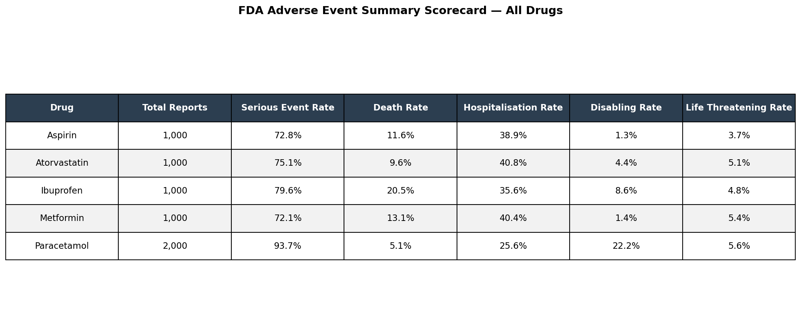
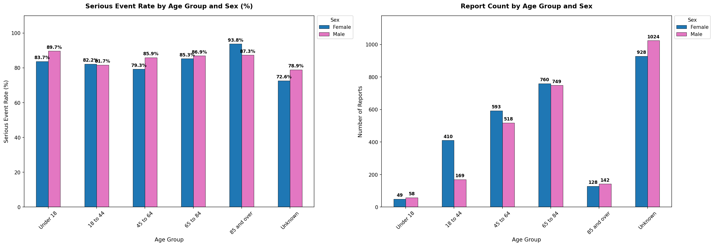

<div align="center">

  

# 💊 MedSignal Analytics

### From openFDA reports to responsible pharmacovigilance insights

  <p>
    <a href="https://app.powerbi.com/view?r=eyJrIjoiOGMxYzdkMGMtMWRlZC00MGI1LTlmYTAtNGU5YjQyODhmNjc3IiwidCI6Ijk0MDJjMzY4LWZiM2MtNGNjMy05ODI4LTgyNDI4YjM2OWNhOSJ9"></a>
    <a href="bi/medsignal_dashboard.pbix"></a>
    <a href="notebooks/01_signal_exploration.ipynb"></a>
  </p>

  <p>
    
    
    
    
    
    <a href="LICENSE"></a>
  </p>

  <strong>6,000 reports · 5 medicines · 15 Python analyses · 15 SQL investigations · 3 Power BI pages</strong>

</div>

---

## 📑 Table of Contents

- [Project Overview](#-project-overview)
- [Executive Snapshot](#-executive-snapshot)
- [About the Dataset](#-about-the-dataset)
- [Repository Structure](#-repository-structure)
- [Analysis Workflow](#-analysis-workflow)
- [Key Findings & Evidence](#-key-findings--evidence)
- [SQL Analysis](#-sql-analysis)
- [Power BI Dashboard](#-power-bi-dashboard)
- [Tools & Technologies](#-tools--technologies)
- [Quick Start](#-quick-start)
- [Limitations & Responsible Use](#-limitations--responsible-use)
- [Author](#-author)
- [License](#-license)

---

## 📌 Project Overview

MedSignal Analytics is an end-to-end healthcare analytics portfolio project built on public reports from the FDA Adverse Event Reporting System (FAERS). It transforms nested openFDA records into an analysis-ready dataset, examines submitted-report patterns across five medicines, screens drug–reaction combinations with Reporting Odds Ratio (ROR), reproduces business questions in PostgreSQL and communicates results through a three-page Power BI report.

The project is designed for **Data Analyst, Healthcare Data Analyst and Business Intelligence Analyst** roles. Its strongest feature is not a single metric—it is the complete path from raw API data to evidence, stakeholder communication and responsible interpretation.

> **Important:** FAERS is a spontaneous reporting system. This project describes patterns within submitted reports; it does not establish causality, medicine risk or population incidence.

---

## ⚡ Executive Snapshot

- Built a complete workflow spanning **API ingestion, cleaning, validation, Python analysis, PostgreSQL and Power BI**.
- Explored **6,000 report records** covering aspirin, ibuprofen, paracetamol/acetaminophen, metformin and atorvastatin.
- Delivered **15 Python analyses, 15 SQL investigations and three dashboard pages** for executive and analyst audiences.
- Identified batch concentration, missing demographics and combination-product matching as interpretation risks that materially affect apparent signals.

---

## 🗂️ About the Dataset

The project uses public drug-event records retrieved through the [openFDA API](https://open.fda.gov/apis/drug/event/) and derived from FAERS.

| Attribute | Project Scope |
|---|---|
| Publisher | U.S. Food and Drug Administration |
| Dataset | FDA Adverse Event Reporting System via openFDA |
| Records | 6,000 report records |
| Medicines | Aspirin, Ibuprofen, Paracetamol, Metformin, Atorvastatin |
| Coverage | January 2022–April 2025 |
| Outcomes | Serious, death, hospitalisation, disabling, life-threatening |
| Dimensions | Receipt date, reporter country, age group and sex when reported |
| Screening method | Reporting Odds Ratio (ROR) |
| Processed extract | `data/processed/adverse_event_reports.csv` |

Complete field definitions are available in the [data dictionary](docs/data_dictionary.md), while analytical choices are explained in the [methodology](docs/methodology.md).

---

## 📁 Repository Structure

```text
MedSignal-Analytics/
├── assets/                         # Header, evidence figures and dashboard previews
├── bi/                             # Power BI source file and PDF report
├── data/processed/                 # Analysis-ready portfolio extract
├── docs/                           # Setup, methodology, dictionary and model notes
├── notebooks/                      # Acquisition-to-insight Jupyter workflow
├── sql/                            # Full and curated PostgreSQL investigations
├── src/medsignal/                  # Reusable validation, metric and CLI logic
├── tests/                          # Automated analytical checks
├── .github/workflows/quality.yml   # GitHub Actions quality gate
└── README.md
```

---

## 🔍 Analysis Workflow



1. **Acquire** public drug-event records from openFDA.
2. **Prepare** dates, age bands, medicine labels and coded outcome fields.
3. **Validate** completeness, distributions and sampling artifacts.
4. **Analyze** outcome proportions, trends, demographics, geography and reaction profiles.
5. **Screen** disproportionate drug–reaction reporting with ROR.
6. **Reproduce** decision questions through documented PostgreSQL queries.
7. **Communicate** the strongest observations and limitations through Power BI.

---

## 📈 Key Findings & Evidence

Each finding below follows the same pattern: **evidence → interpretation → limitation**. This keeps the visual story consistent and avoids presenting screening statistics as clinical conclusions.

### 1️⃣ The portfolio shows different reporting profiles—not one universal ranking

Across the extract, **81.15%** of records were classified as serious. Paracetamol had the largest serious-report proportion (**93.65%**), ibuprofen the largest death-report proportion (**20.50%**) and atorvastatin the largest hospitalisation proportion (**40.80%**).

The mixed ranking is the key takeaway: one outcome cannot summarize the entire reporting profile. These percentages use submitted reports—not medicine users—as the denominator.

[](assets/evidence-summary-scorecard.png)

---

### 2️⃣ Cross-medicine comparison reveals where the outcome mix differs

The comparative heatmap brings serious, fatal, hospitalisation, disabling and life-threatening proportions into one view. Paracetamol shows the largest disabling proportion (**22.25%**), while hospitalisation is highest for atorvastatin (**40.80%**) and metformin (**40.40%**).

This is a descriptive comparison of the selected extract. Product mix, indication, co-medication and reporting behavior can all influence the observed differences.

[](assets/evidence-drug-heatmap.png)

---

### 3️⃣ ROR screening surfaced an important product-definition problem

The largest ROR results included paracetamol–drug withdrawal syndrome, paracetamol–drug dependence and metformin–lactic acidosis. ROR identifies combinations reported more often than expected relative to other records in the analyzed sample.

The paracetamol search also captured combination products, including opioid-containing products. That explains why dependency and withdrawal terms require especially careful interpretation. The correct next step is refined product filtering and case review—not a causal claim.

[](assets/evidence-ror-signals.png)

---

### 4️⃣ Demographic analysis is useful, but missing age changes the confidence level

Patients aged **65–84** formed the largest known age band, while the **85+** group showed the largest serious-report proportions for women and men in the extract. However, **39.73%** of records have no reported age and **7.87%** have no reported sex.

The interaction view is therefore exploratory. It identifies segments worth reviewing but cannot represent the demographic risk of the wider treated population.

[](assets/evidence-age-sex-interaction.png)

---

### 5️⃣ The apparent time trend is dominated by extraction and coverage effects

The serious-report proportion increased from **80.42% in 2022** to **91.94% in partial-year 2025**. Death-report proportions declined through 2024 before rising in the partial 2025 period.

More than **5,000 records were received in January 2022**, and 2025 is incomplete. The chart is valuable as a data-quality finding: the movement should be re-tested with balanced quarterly sampling before supporting a decision.

[](assets/evidence-yearly-trends.png)

---

## 🗄️ SQL Analysis

The processed dataset was loaded into **PostgreSQL 16** and analyzed through 15 queries in [`sql/pharmacovigilance_analysis.sql`](sql/pharmacovigilance_analysis.sql). A concise analyst-facing set is available in [`sql/portfolio_queries.sql`](sql/portfolio_queries.sql).

| Business Question | SQL Capability |
|---|---|
| How does the product and outcome mix compare? | Conditional aggregation and grouped percentages |
| Which medicines rank highest by selected measures? | Ranking and window functions |
| How does reporting move over time? | Date grouping and `LAG` |
| Which demographic/geographic groups appear most often? | Cross-tabulation and top-N analysis |
| Where is information incomplete? | Null and unknown-rate monitoring |

The SQL layer provides an auditable path from cleaned records to dashboard-ready outputs without requiring notebook execution.

---

## 📊 Power BI Dashboard

The existing Power BI report turns the analysis into three stakeholder-facing pages.

<div align="center">

[](https://app.powerbi.com/view?r=eyJrIjoiOGMxYzdkMGMtMWRlZC00MGI1LTlmYTAtNGU5YjQyODhmNjc3IiwidCI6Ijk0MDJjMzY4LWZiM2MtNGNjMy05ODI4LTgyNDI4YjM2OWNhOSJ9)
[](bi/medsignal_dashboard.pbix)

</div>

> A verified public Power BI Service URL is not currently included. The button opens the complete three-page PDF report; the `.pbix` provides the interactive desktop version.

### Page 1 — Executive Summary

Headline KPIs and high-level medicine comparisons establish the scale and outcome mix.

[](assets/dashboard-executive-summary.png)

### Page 2 — Drug Safety Comparison

Medicine-level visuals compare serious, fatal, hospitalisation, disabling and life-threatening submitted-report proportions.

[](assets/dashboard-drug-safety.png)

### Page 3 — Demographics & Signal Detection

Reported age, sex, geography and ROR evidence support deeper investigation while keeping missingness visible.

[](assets/dashboard-demographics.png)

See the [Power BI model notes](docs/powerbi_model.md) for page structure, measure patterns, interactions and refresh guidance.

---

## 🧩 Tools & Technologies

| Category | Technology |
|---|---|
| Data source | openFDA API / FAERS |
| Analysis | Python, pandas, NumPy, SciPy |
| Visualization | Matplotlib, Seaborn |
| Database | PostgreSQL, SQLAlchemy, psycopg2 |
| Business intelligence | Microsoft Power BI |
| Exploration | JupyterLab |
| Quality | pytest, Ruff, GitHub Actions |

---

## 🛠️ Quick Start

```bash
git clone https://github.com/dineshbarri/medsignal-analytics.git
cd medsignal-analytics
python -m venv .venv
pip install -e ".[analysis,dev]"
jupyter lab notebooks/01_signal_exploration.ipynb
```

Run the quality checks:

```bash
ruff check src tests
pytest -q
```

For Windows activation, PostgreSQL configuration, optional API access and Power BI instructions, follow the [complete setup guide](docs/setup.md).

---

## ⚠️ Limitations & Responsible Use

- FAERS is affected by under-reporting, stimulated reporting, missing information and potential duplication.
- A submitted report does not establish that a medicine caused an event.
- Exposure denominators are unavailable, so report proportions are not incidence rates.
- The extract is a capped portfolio sample rather than the complete FAERS population.
- January 2022 concentration and partial 2025 coverage weaken time comparisons.
- The paracetamol/acetaminophen search includes combination products.
- ROR is a screening statistic; case review, uncertainty estimates, clinical context and external evidence are required before escalation.

---

## 👨‍💻 Author

### Dinesh Barri

Data analyst focused on healthcare analytics, business intelligence, Python, SQL and decision-ready storytelling.

[](https://github.com/dineshbarri)
[](https://www.linkedin.com/in/dinesh-barri-7654b010b)

Contributions, questions and suggestions are welcome through the repository's Issues tab.

---

## 📄 License

[](LICENSE)

This project is available under the [MIT License](LICENSE).

---

<div align="center">
  <strong>⭐ If this project helped you, consider starring the repository.</strong><br>
  Built with analytical care by <a href="https://github.com/dineshbarri">Dinesh Barri</a>.
</div>
