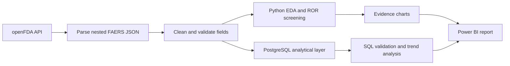
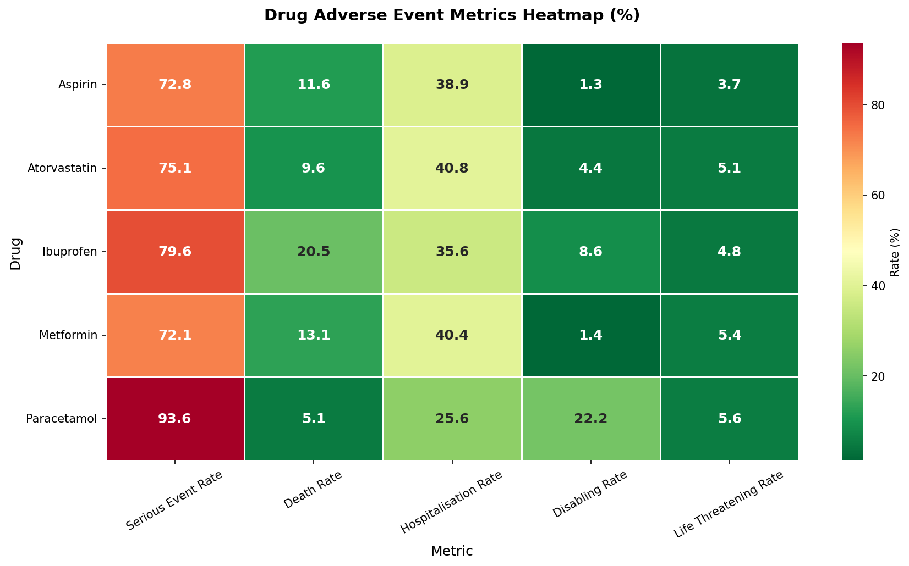
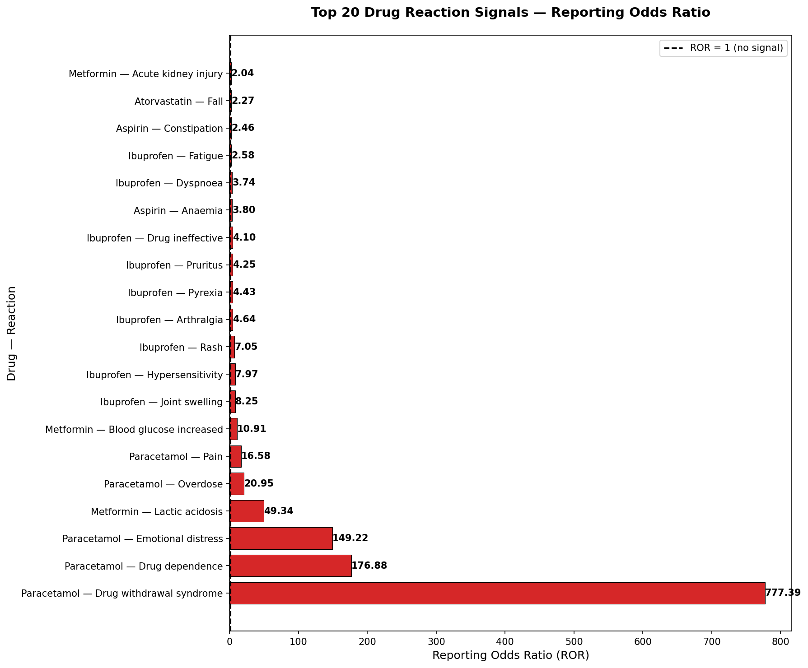
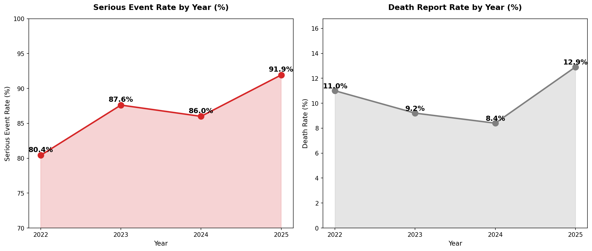
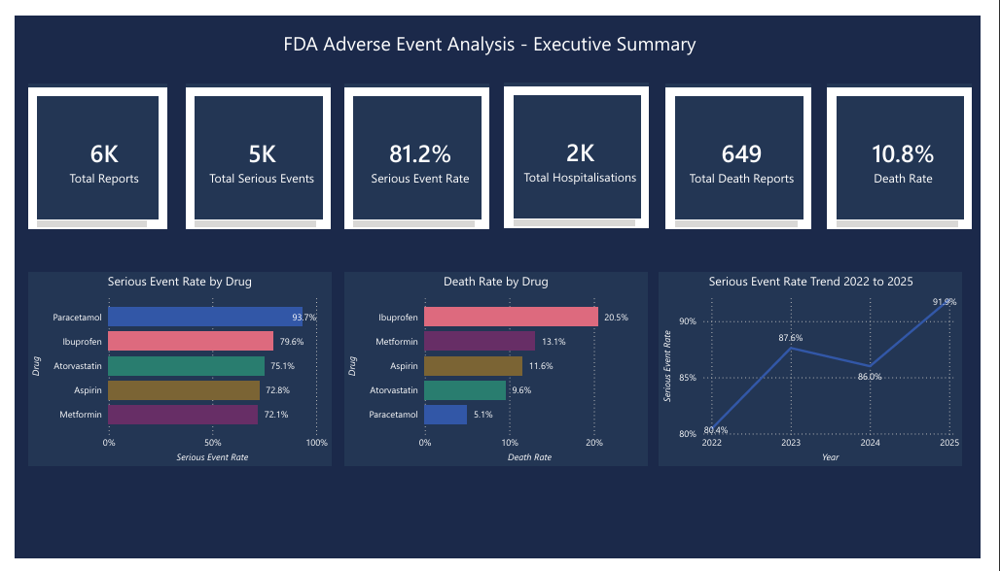
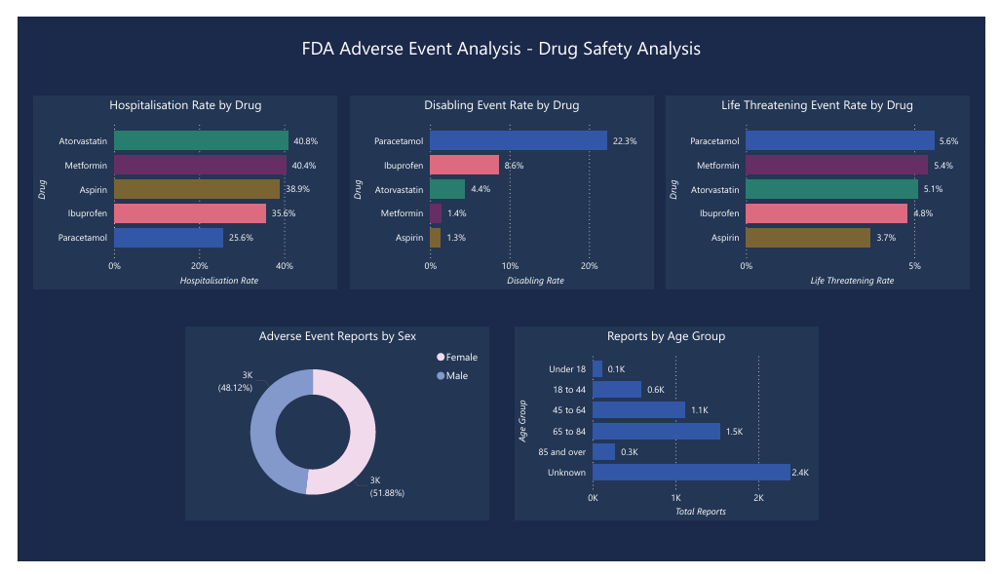
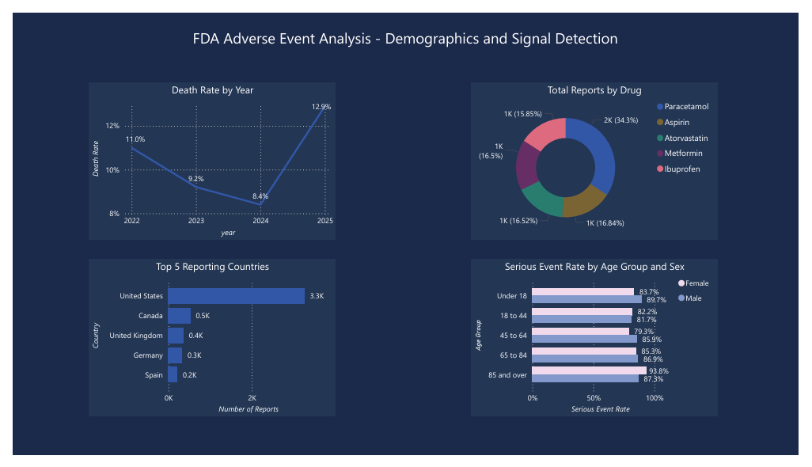

<div align="center">

  

  # MedSignal Analytics

  ### FDA adverse-event signal detection with Python, PostgreSQL, SQL and Power BI

  <p>
    <a href="bi/medsignal_dashboard.pdf"></a>
    <a href="bi/medsignal_dashboard.pbix"></a>
    <a href="notebooks/01_signal_exploration.ipynb"></a>
  </p>

  <p>
    
    
    
    
    
    <a href="LICENSE"></a>
  </p>

  <p><strong>6,000 reports · 5 medicines · 15 Python analyses · 15 SQL investigations · 3 Power BI pages</strong></p>

</div>

---

## Table of contents

- [Project overview](#project-overview)
- [Business questions](#business-questions)
- [About the dataset](#about-the-dataset)
- [Analytics workflow](#analytics-workflow)
- [Key findings](#key-findings)
- [SQL analysis](#sql-analysis)
- [Power BI dashboard](#power-bi-dashboard)
- [Technology stack](#technology-stack)
- [Repository structure](#repository-structure)
- [Setup and reproduction](#setup-and-reproduction)
- [Limitations and responsible use](#limitations-and-responsible-use)
- [Future enhancements](#future-enhancements)
- [Author](#author)
- [License](#license)

---

## Project overview

**MedSignal Analytics** is an end-to-end healthcare analytics project built on public reports from the FDA Adverse Event Reporting System (FAERS). It transforms nested openFDA responses into an analysis-ready dataset, validates data quality, compares serious outcomes across five widely used medicines, screens drug–reaction combinations using Reporting Odds Ratio (ROR), reproduces findings in PostgreSQL, and presents the results through a three-page Power BI report.

The project is designed as a portfolio case study for **Healthcare Data Analyst, Data Analyst, Business Intelligence Analyst and Junior Analytics Engineer** roles. It demonstrates the complete path from API ingestion to stakeholder-ready insight—not only a finished dashboard.

> **Responsible-use note:** FAERS contains spontaneous safety reports. These data can reveal reporting patterns and signals, but they cannot establish causality or population incidence.

## Business questions

- Which medicines have the highest reported serious, fatal, disabling and hospitalisation proportions?
- Which drug–reaction combinations are disproportionately reported relative to the rest of the dataset?
- How did serious-event and death-report proportions move between 2022 and 2025?
- Which age and sex groups appear most often in serious reports?
- Where are reports submitted from, and how concentrated is reporting geographically?
- How complete are the demographic fields, and which data-quality issues could change interpretation?

## About the dataset

The portfolio extract contains **6,000 adverse-event reports** retrieved from the [openFDA drug-event API](https://open.fda.gov/apis/drug/event/) and derived from FAERS. It covers aspirin, ibuprofen, paracetamol/acetaminophen, metformin and atorvastatin between **January 2022 and April 2025**.

| Attribute | Project scope |
|---|---|
| Source system | FDA Adverse Event Reporting System via openFDA |
| Analytical grain | One normalized product-report record |
| Records | 6,000 |
| Medicines | 5 |
| Date coverage | January 2022–April 2025 |
| Geographic field | Reporter country |
| Demographics | Patient age, age group and sex when reported |
| Outcomes | Serious, death, hospitalisation, disabling and life-threatening flags |
| Signal method | Reporting Odds Ratio (ROR) |
| Included extract | `data/processed/adverse_event_reports.csv` |

### Core analytical fields

| Field | Description |
|---|---|
| `drug_name` | Normalized medicine used for comparison |
| `serious_label` | Serious or non-serious report classification |
| `seriousnessdeath` | Death outcome flag |
| `seriousnesshospitalisation` | Hospitalisation outcome flag |
| `seriousnessdisabling` | Disabling outcome flag |
| `seriousnesslifethreatening` | Life-threatening outcome flag |
| `receive_date` | Date the FDA received the report |
| `reporter_country` | Reporter country code when available |
| `patient_age`, `age_group` | Patient age and derived analytical band |
| `sex_label` | Normalized sex category |
| `year`, `month`, `quarter` | Calendar dimensions derived from receive date |

The complete field definitions are documented in the [data dictionary](docs/data_dictionary.md).

## Analytics workflow



1. **Acquire:** Query public drug-event records through openFDA.
2. **Structure:** Extract report identifiers, outcomes, reaction terms, dates, country and demographics from nested JSON.
3. **Prepare:** Standardize medicine names, convert dates and ages, map coded outcome values and engineer calendar and age-band fields.
4. **Validate:** Profile missingness, record distribution and known sampling artifacts before interpreting metrics.
5. **Analyze:** Run 15 Python analyses covering outcome severity, trends, demographics, geography, reaction profiles and ROR signals.
6. **Query:** Load the analytical table into PostgreSQL and answer the same decision questions with reproducible SQL.
7. **Communicate:** Translate the strongest findings into a three-page Power BI report for executive and analyst audiences.

## Key findings

### 1. Serious outcomes were common in the submitted-report sample

**81.15%** of the 6,000 records were classified as serious. Paracetamol had the highest serious-report proportion (**93.65%**), while aspirin had the lowest (**72.80%**). These are proportions within submitted FAERS reports—not adverse-event incidence among medicine users.



### 2. Different medicines led different severity measures

- **Ibuprofen** had the highest death-report proportion at **20.50%**.
- **Atorvastatin** had the highest hospitalisation proportion at **40.80%**.
- **Paracetamol** had the highest disabling proportion at **22.25%**, but the lowest death-report proportion at **5.05%**.
- **Metformin** combined a **13.10%** death-report proportion with a **40.40%** hospitalisation proportion.

The mixed ranking is important: no single severity measure should be used as a complete safety assessment.

### 3. ROR screening surfaced highly disproportionate combinations

The strongest observed ROR was **paracetamol–drug withdrawal syndrome (777.39)**, followed by paracetamol–drug dependence (**176.88**) and emotional distress (**149.22**). Metformin–lactic acidosis reached **49.34**. These results prioritize combinations for review; they do not prove that a product caused the reaction.



The extreme paracetamol pattern also exposed a data-definition issue: searching acetaminophen/paracetamol captured opioid combination products, not only single-ingredient formulations. That finding became a concrete recommendation to apply stricter medicinal-product filtering in future analysis.

### 4. The apparent time trend requires caution

The serious-report proportion moved from **80.42% in 2022** to **91.94% in partial-year 2025**. The death-report proportion declined to **8.40% in 2024** before rising to **12.90% in partial-year 2025**.



However, **5,017 records were received in January 2022**, creating a major batch-submission artifact. The trend is descriptive and should be re-tested with stratified quarterly sampling before being used for decisions.

### 5. Demographic completeness limits subgroup conclusions

- Patients aged **65–84** formed the largest known age band with **1,534 reports**.
- The **85+** group had the highest serious-report proportions for both women (**93.75%**) and men (**87.32%**).
- **39.73%** of records had no reported patient age and **7.87%** had no reported sex.

This missingness is material: demographic comparisons should be treated as exploratory rather than representative of all medicine users.

## SQL analysis

The cleaned analytical dataset was loaded into **PostgreSQL 16** and investigated through **15 documented queries** in [`sql/pharmacovigilance_analysis.sql`](sql/pharmacovigilance_analysis.sql). A smaller production-style query set is provided in [`sql/portfolio_queries.sql`](sql/portfolio_queries.sql).

| Analytical capability | SQL approach |
|---|---|
| Product and report mix | `COUNT`, grouped percentages and window totals |
| Serious, fatal and hospital outcomes | Conditional aggregation with `CASE WHEN` |
| Product risk comparison | Product-level rates with ranked ordering |
| Yearly and monthly movement | Date grouping and `LAG` window functions |
| Demographic segmentation | Age-group and sex cross-tabulation |
| Geographic concentration | Country normalization, ranking and top-N selection |
| Data-quality monitoring | Null/unknown rates by product |
| Executive scorecard | Multiple outcome KPIs combined into one comparative query |

The SQL work independently validates the Python calculations and provides a reusable analyst layer that can feed BI tools without depending on notebook execution.

## Power BI dashboard

The Power BI report converts the analytical outputs into three complementary pages. Open the [dashboard report](bi/medsignal_dashboard.pdf) in the browser or download [`medsignal_dashboard.pbix`](bi/medsignal_dashboard.pbix) for the interactive desktop experience.

### Page 1 — Executive summary

Six headline KPIs summarize report volume, serious outcomes, hospitalisations, death reports and the strongest product-level comparisons.



### Page 2 — Drug safety comparison

Product-level visuals compare serious, fatal, hospitalisation, disabling and life-threatening report proportions alongside drug-specific patterns.



### Page 3 — Demographics and signal detection

The final page combines age/sex segmentation, reporting geography and ROR signal evidence to support deeper investigation.



> **Live dashboard publishing:** the repository includes the complete `.pbix` and browser-viewable PDF. After publishing the report to Power BI Service, replace the dashboard-report button link at the top with your Power BI “Publish to web” URL.

## Technology stack

| Layer | Technology | Purpose |
|---|---|---|
| Data source | openFDA API / FAERS | Public post-market adverse-event reports |
| Programming | Python 3.10+ | Acquisition, cleaning, analysis and reusable package logic |
| Data analysis | pandas, NumPy, SciPy | Transformation, profiling and statistical calculations |
| Visualization | Matplotlib, Seaborn | Evidence charts and comparative heatmaps |
| Database | PostgreSQL 16 | Structured analytical storage and query execution |
| Database access | SQLAlchemy, psycopg2 | Python-to-PostgreSQL integration |
| Business intelligence | Microsoft Power BI | Interactive KPI and investigation pages |
| Exploration | JupyterLab | Reproducible analytical narrative |
| Quality | pytest, Ruff, GitHub Actions | Tests, linting and continuous integration |

## Repository structure

```text
MedSignal-Analytics/
├── assets/                         # Hero, evidence charts and dashboard previews
├── bi/                             # Power BI source and browser-viewable PDF
├── data/processed/                 # Analysis-ready portfolio extract
├── docs/                           # Methodology, dictionary and interview notes
├── notebooks/                      # Full acquisition-to-insight workflow
├── sql/                            # 15 investigations and curated SQL layer
├── src/medsignal/                  # Validation, KPI, ROR and CLI package
├── tests/                          # Automated analytical-logic tests
├── .github/workflows/quality.yml   # CI quality gate
├── .env.example                    # Safe configuration template
├── pyproject.toml                  # Package and dependency configuration
└── README.md
```

## Setup and reproduction

### Prerequisites

- Git
- Python **3.10 or newer**
- JupyterLab for notebook exploration
- PostgreSQL **14 or newer** for the SQL workflow
- Power BI Desktop for the interactive dashboard (`.pbix`)
- Optional openFDA API key for fresh data acquisition

### 1. Clone the repository

```bash
git clone https://github.com/dineshbarri/medsignal-analytics.git
cd medsignal-analytics
```

### 2. Create and activate a virtual environment

**Windows PowerShell**

```powershell
python -m venv .venv
.\.venv\Scripts\Activate.ps1
```

**macOS/Linux**

```bash
python3 -m venv .venv
source .venv/bin/activate
```

### 3. Install the project

```bash
pip install -e ".[analysis,dev]"
```

For the lightweight tested package and CLI only, use `pip install -e ".[dev]"`.

### 4. Run the included dataset through the quality pipeline

```bash
medsignal profile data/processed/adverse_event_reports.csv
```

This validates the required schema, reports duplicate and missing-value counts, and prints product-level serious, death and hospitalisation metrics.

### 5. Configure optional API and PostgreSQL access

```powershell
Copy-Item .env.example .env
```

On macOS/Linux, run `cp .env.example .env`. Set `OPENFDA_API_KEY` for fresh API data and update `DATABASE_URL` with local PostgreSQL credentials. Never commit the completed `.env` file.

### 6. Run the notebook

```bash
jupyter lab notebooks/01_signal_exploration.ipynb
```

Use **Kernel → Restart Kernel and Run All Cells**. The notebook covers acquisition, parsing, data quality, cleaning, 15 analytical views, PostgreSQL loading, SQL validation, findings and limitations.

### 7. Run the PostgreSQL analysis

```bash
createdb fda_pharmacovigilance
psql -d fda_pharmacovigilance -f sql/pharmacovigilance_analysis.sql
```

Run the notebook’s database-load section before executing the queries. Add `-U` and `-h` if your PostgreSQL user or host differs.

### 8. Open the Power BI report

1. Install [Microsoft Power BI Desktop](https://powerbi.microsoft.com/desktop/).
2. Open `bi/medsignal_dashboard.pbix`.
3. In **Transform data → Data source settings**, point the report to your local CSV or PostgreSQL table if refresh is required.
4. Apply changes and use the report filters to compare medicines, years and demographic groups.

### 9. Run engineering quality checks

```bash
ruff check src tests
pytest -q
```

The same checks run automatically through GitHub Actions on pushes and pull requests.

## Limitations and responsible use

- FAERS is affected by under-reporting, duplicates, stimulated reporting and missing fields.
- A report does not establish that a medicine caused an event.
- Report proportions are not population incidence rates because treatment-exposure denominators are unavailable.
- The extract is a capped portfolio sample rather than the complete FAERS population.
- The 2022 batch concentration and partial 2025 coverage weaken time-trend comparisons.
- Acetaminophen/paracetamol searches captured combination products; medicinal-product filtering is required for ingredient-specific conclusions.
- ROR is a screening statistic. Case review, confidence intervals, clinical context and external evidence are required before escalation.

## Future enhancements

- Retrieve stratified quarterly samples to reduce the 2022 batch artifact.
- Separate single-ingredient products from combination medicines using stricter product identifiers.
- Add lower-confidence-bound and minimum-case thresholds to the ROR signal pipeline.
- Introduce deduplication using report identifiers and version history.
- Publish the Power BI report to Power BI Service and connect the live-dashboard button.
- Schedule quarterly refreshes with automated data-quality monitoring.

## Author

### Dinesh Barri

Data analyst focused on healthcare analytics, business intelligence, Python, SQL and decision-ready storytelling.

[](https://github.com/dineshbarri)
[](https://www.linkedin.com/in/dinesh-barri-7654b010b)

Contributions, analytical questions and suggestions are welcome through the repository’s Issues tab.

## License

[](LICENSE)

This project is available under the [MIT License](LICENSE).

---

<div align="center">
  <strong>If this project helped you, consider starring the repository.</strong><br>
  Built with analytical rigor by <a href="https://github.com/dineshbarri">Dinesh Barri</a>.
</div>
