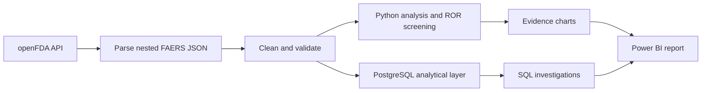

<div align="center">

  

# MedSignal Analytics

### Exploring FDA adverse-event reporting patterns with Python, PostgreSQL, SQL and Power BI

  <p>
    <a href="bi/medsignal_dashboard.pdf"></a>
    <a href="bi/medsignal_dashboard.pbix"></a>
    <a href="notebooks/01_signal_exploration.ipynb"></a>
  </p>

  <p>
    
    
    
    
    <a href="LICENSE"></a>
  </p>

  <strong>6,000 reports · 5 medicines · 15 Python analyses · 15 SQL investigations · 3 dashboard pages</strong>

</div>

---

## Contents

- [Executive snapshot](#executive-snapshot)
- [What this project solves](#what-this-project-solves)
- [Dataset](#dataset)
- [Workflow](#workflow)
- [Analytical deliverables](#analytical-deliverables)
- [Key findings](#key-findings)
- [Power BI dashboard](#power-bi-dashboard)
- [SQL contribution](#sql-contribution)
- [Quick start](#quick-start)
- [Limitations](#limitations)
- [Author](#author)
- [License](#license)

## Executive snapshot

- Built an end-to-end FAERS analytics workflow covering API ingestion, validation, SQL analysis, Reporting Odds Ratio (ROR) screening and Power BI.
- Explored a portfolio sample of **6,000 submitted reports** across five medicines and translated the results into three stakeholder-facing dashboard pages.
- Delivered **15 Python analyses** and **15 PostgreSQL investigations** spanning outcomes, reporting trends, demographics, geography and reaction patterns.
- Identified missing data, batch concentration and product-normalization risks that materially affect how apparent signals should be interpreted.

> **Responsible-use note:** FAERS contains spontaneous safety reports. This project describes reporting patterns; it does not estimate medicine risk, prove causality or provide medical advice.

## What this project solves

MedSignal Analytics converts nested public openFDA drug-event records into an analysis-ready portfolio dataset and a decision-friendly analytical story. It addresses four practical questions:

- How do submitted serious, fatal, hospitalisation, disabling and life-threatening outcome proportions vary across the selected medicines?
- Which drug–reaction pairs appear disproportionately represented within this sample?
- How do report outcomes vary over time and across reported demographic groups?
- Which data-quality limitations could change the interpretation of those comparisons?

The repository demonstrates the full analyst workflow: acquisition, cleaning, validation, exploratory analysis, SQL investigation, visual communication and responsible interpretation.

## Dataset

The included extract contains **6,000 adverse-event reports** retrieved through the [openFDA drug-event API](https://open.fda.gov/apis/drug/event/) and derived from the FDA Adverse Event Reporting System. It covers aspirin, ibuprofen, paracetamol/acetaminophen, metformin and atorvastatin from **January 2022 to April 2025**.

| Attribute | Scope |
|---|---|
| Source | FDA Adverse Event Reporting System via openFDA |
| Analytical grain | One normalized product-report record |
| Records / medicines | 6,000 / 5 |
| Outcomes | Serious, death, hospitalisation, disabling and life-threatening flags |
| Supporting dimensions | Receipt date, reporter country, age band and sex when reported |
| Signal method | Reporting Odds Ratio (ROR) |
| Included extract | `data/processed/adverse_event_reports.csv` |

Field definitions are available in the [data dictionary](docs/data_dictionary.md), with analytical decisions documented in the [methodology](docs/methodology.md).

## Workflow



1. **Acquire:** retrieve public drug-event records from openFDA.
2. **Prepare:** normalize medicine names, dates, ages and coded outcome fields.
3. **Validate:** profile missingness, sample balance and known extraction artifacts.
4. **Analyze:** compare outcomes, time patterns, demographics, geography and reaction reporting.
5. **Query:** reproduce the business questions through documented PostgreSQL queries.
6. **Communicate:** present the strongest observations and caveats across three Power BI pages.

## Analytical deliverables

The project is designed to show both analytical reasoning and implementation breadth. Each layer has a
clear portfolio purpose rather than duplicating the same output in a different tool.

| Layer | Technology | Demonstrated capability |
|---|---|---|
| Acquisition and preparation | Python, pandas | Nested JSON parsing, field normalization and reusable transformations |
| Statistical exploration | Python, NumPy, SciPy | Descriptive profiling, subgroup comparisons and ROR screening |
| Reproducible narrative | JupyterLab | Code, evidence, interpretation and caveats in one reviewable workflow |
| Analytical querying | PostgreSQL, SQL | Conditional aggregation, CTEs, ranking and window functions |
| Evidence visuals | Matplotlib, Seaborn | Comparative heatmaps, signal ranking and reporting trends |
| Business intelligence | Power BI | KPI design, filters and three stakeholder-facing report pages |
| Quality controls | pytest, Ruff, GitHub Actions | Automated checks for reusable analytical code |

The notebook contains the complete acquisition-to-insight narrative, while the `src/medsignal` package
separates reusable validation and metric logic from presentation. The SQL scripts provide a second,
auditable route to core comparisons. Power BI then packages the outputs for a reader who needs the main
patterns and limitations without stepping through code.

```text
MedSignal-Analytics/
├── assets/              # Project header, evidence charts and dashboard previews
├── bi/                  # Power BI source file and browser-viewable PDF
├── data/processed/      # Analysis-ready portfolio extract
├── docs/                # Methodology, data dictionary, setup and model notes
├── notebooks/           # End-to-end analytical notebook
├── sql/                 # Full and curated PostgreSQL investigations
├── src/medsignal/       # Reusable validation, KPI and ROR logic
├── tests/               # Automated analytical-logic checks
└── README.md
```

## Key findings

### 1. Serious classifications were frequent within the submitted-report sample

Overall, **81.15%** of records were classified as serious. The sample ranged from **72.80% for aspirin** to **93.65% for paracetamol**. These percentages use submitted reports as the denominator and must not be interpreted as incidence among medicine users.


### 2. Outcome rankings varied by measure

Ibuprofen had the largest death-report proportion in the extract (**20.50%**), atorvastatin the largest hospitalisation proportion (**40.80%**) and paracetamol the largest disabling proportion (**22.25%**). These descriptive differences may reflect product mix, reporting behavior, indication, co-medication and sampling—not inherent comparative safety.

### 3. ROR results created a review queue, not a clinical conclusion

The largest observed RORs included paracetamol–drug withdrawal syndrome, paracetamol–drug dependence and metformin–lactic acidosis. ROR measures disproportional reporting inside the analyzed records. It does not account for exposure, background disease or causal attribution, so the combinations are candidates for further review only.


The paracetamol query also captured combination products, including opioid-containing products. That normalization issue could inflate or redirect reaction patterns and should be resolved before ingredient-specific interpretation.

This is the most decision-relevant finding in the project: a technically valid calculation can still be
misleading when the product definition is too broad. The appropriate action is to refine the cohort and
repeat the screen—not to treat the largest ROR as the strongest clinical evidence.

### 4. Data quality limits the time and demographic story

More than **5,000 records were received in January 2022**, while 2025 is only partially represented. In addition, **39.73%** of records have no reported age and **7.87%** have no reported sex. Time and subgroup comparisons are therefore exploratory and should be re-tested using a balanced sampling design.


## Power BI dashboard

The downloadable Power BI report presents the existing analysis across three pages. The button at the top opens a PDF report; it is intentionally not labelled as a live dashboard.

The page sequence follows a deliberate reading path: establish the scale and selected outcomes, compare
medicine cohorts, and then expose demographic context and screening detail. Product, time and demographic
filters support exploration in the `.pbix`; the PDF provides a zero-install portfolio preview.

### Page 1 — Executive summary

Headline KPIs summarize report volume and selected submitted-report outcomes.


### Page 2 — Drug safety comparison

Medicine-level visuals compare serious, fatal, hospitalisation, disabling and life-threatening report proportions.

This page helps reviewers see why a single outcome cannot summarize the entire reporting profile. Each
measure uses records currently in filter context as its denominator.


### Page 3 — Demographics and signal detection

The final page combines reported age and sex patterns, geography and ROR screening for deeper exploration.

The purpose is investigation prioritization. Missing demographics and the absence of exposure denominators
remain part of the interpretation, even when a chart displays a large difference.


Open the browser-friendly [dashboard PDF](bi/medsignal_dashboard.pdf), download the [Power BI file](bi/medsignal_dashboard.pbix), or review the [Power BI model notes](docs/powerbi_model.md).

## SQL contribution

The cleaned table was analyzed in **PostgreSQL 16** through 15 documented queries in [`sql/pharmacovigilance_analysis.sql`](sql/pharmacovigilance_analysis.sql). A curated analyst-facing set is available in [`sql/portfolio_queries.sql`](sql/portfolio_queries.sql).

| Capability | SQL techniques |
|---|---|
| Outcome scorecards | Conditional aggregation and grouped percentages |
| Product comparisons | Ranking and window totals |
| Time analysis | Date grouping and `LAG` |
| Demographic/geographic cuts | Cross-tabulation, normalization and top-N selection |
| Data-quality monitoring | Null and unknown rates by product |

The SQL layer provides an auditable route from the cleaned dataset to dashboard-ready comparisons without requiring readers to inspect every notebook cell.

Representative business questions include which medicines account for the largest share of submitted
serious reports, how outcome proportions change across calendar periods, which demographic fields are
least complete, and where reporting is geographically concentrated. Window functions support ranked and
period-over-period comparisons; conditional aggregation keeps the KPI definitions explicit.

## Quick start

```bash
git clone https://github.com/dineshbarri/medsignal-analytics.git
cd medsignal-analytics
python -m venv .venv
pip install -e ".[analysis,dev]"
jupyter lab notebooks/01_signal_exploration.ipynb
```

Run quality checks with:

```bash
ruff check src tests
pytest -q
```

For Windows activation, PostgreSQL configuration, optional API access and Power BI instructions, follow the [complete setup guide](docs/setup.md).

### Repository review path

If you are reviewing the project rather than rebuilding it, start with the three dashboard previews,
scan the four findings above, open the notebook for calculation evidence, and then inspect the curated SQL
queries. This path provides a concise view of business communication, analytical judgment and technical depth.

## Limitations

- FAERS is affected by under-reporting, stimulated reporting, missing fields and potential duplication.
- Reports do not establish that a medicine caused an event.
- Treatment-exposure denominators are unavailable, so report proportions are not incidence rates.
- The dataset is a capped portfolio extract rather than the complete FAERS population.
- January 2022 concentration and partial 2025 coverage weaken time comparisons.
- The paracetamol/acetaminophen search includes combination products.
- ROR is a screening statistic; clinical context, case review, uncertainty estimates and external evidence are required before escalation.

## Author

### Dinesh Barri

Data analyst focused on healthcare analytics, business intelligence, Python, SQL and decision-ready storytelling.

[](https://github.com/dineshbarri)
[](https://www.linkedin.com/in/dinesh-barri-7654b010b)

Contributions and analytical questions are welcome through the repository's Issues tab.

## License

[](LICENSE)

This project is available under the [MIT License](LICENSE).

---

<div align="center">
  <strong>If this project helped you, consider starring the repository.</strong><br>
  Built with analytical care by <a href="https://github.com/dineshbarri">Dinesh Barri</a>.
</div>
