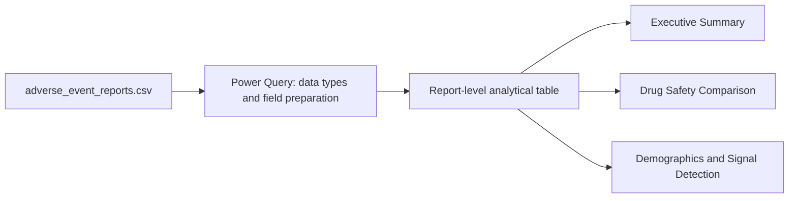

# Power BI model and report notes

This document describes the existing portfolio dashboard. It does not claim that the PBIX was rebuilt
or technically modified for this documentation release.

## Reporting model

The dashboard is driven by the processed report-level extract:



The portfolio design uses a flattened analytical table, so medicine, date, country, demographic and
outcome fields are available from the same report-level source. ROR outputs were prepared during the
analysis workflow and presented as screening evidence.

## Primary fields

| Purpose | Fields |
|---|---|
| Medicine | `drug_name` |
| Report outcome | `serious_label`, seriousness outcome flags |
| Time | `receive_date`, `year`, `month`, `quarter` |
| Demographics | `patient_age`, `age_group`, `sex_label` |
| Geography | `reporter_country` |

## Measure patterns

The report uses standard count and submitted-report proportion patterns. Equivalent DAX patterns are:

```DAX
Total Reports = COUNTROWS(adverse_event_reports)

Serious Reports =
CALCULATE([Total Reports], adverse_event_reports[serious_label] = "Serious")

Serious Report % = DIVIDE([Serious Reports], [Total Reports], 0)

Death Reports =
CALCULATE(
    [Total Reports],
    adverse_event_reports[seriousnessdeath] = 1
)

Death Report % = DIVIDE([Death Reports], [Total Reports], 0)
```

These formulas document the intended denominator: records in the current filter context. They are not
clinical incidence measures.

## Pages and interactions

### Executive Summary

- KPI cards for report volume and selected outcomes
- Product-level outcome comparisons
- Reporting movement over time

### Drug Safety Comparison

- Medicine-level comparisons across serious, fatal, hospitalisation, disabling and life-threatening flags
- Filters intended to support product and period exploration

### Demographics and Signal Detection

- Reported age, sex and country distributions
- ROR screening evidence for investigation prioritization

Slicers should filter the visuals on their page. Use **Format → Edit interactions** in Power BI Desktop
to inspect or adjust individual visual behavior.

## Refresh instructions

1. Open `bi/medsignal_dashboard.pbix` in Power BI Desktop.
2. Select **Transform data → Data source settings**.
3. Change the source to `data/processed/adverse_event_reports.csv` if the saved path is unavailable.
4. Confirm dates, numeric outcome flags and age fields have the expected data types.
5. Select **Close & Apply** and then **Home → Refresh**.
6. Check all three pages for errors before saving or exporting a PDF.

## Design decisions and caveats

- The report favors a simple single-table portfolio model for accessibility and fast exploration.
- Outcome percentages use submitted reports as their denominator.
- The PDF button is labelled **View Dashboard Report**, because a PDF is not a live Power BI dashboard.
- The 2022 batch concentration, partial 2025 coverage, missing demographics and combination-product
  matching remain visible analytical limitations.
- ROR outputs support screening and prioritization only; they do not establish causality.
